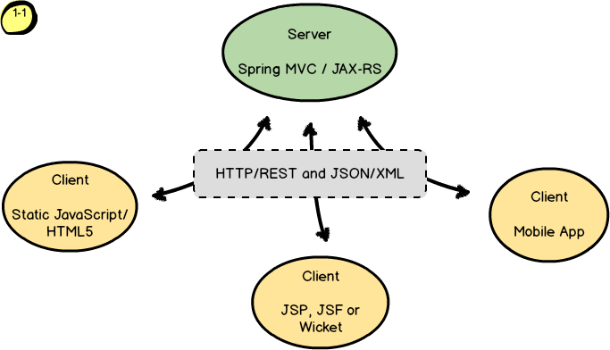
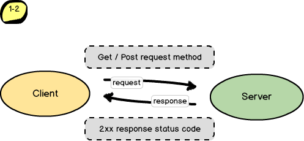

Вот еще один рабочий патч, но уже не с заплаткой а с примером  того как можно внедрить отлов 500х ошибкок, таким образом чтобы клиент тоже не фейлился а получал некий вменяемый результат, на основании которого он сможет влиять на дальнейшее развитие событий, и все это без тоны повторяющихся try..catch..finally.

Основные идеи:

1.	Внедряем кастомные исключения типа BackendException на бакэнде на уровне Сервисов, таким образом чтобы уровень Сервисов не был ни как не связан с уровнем Вью (Rest, Controllers, Resources). Можно заюзать и стандартные типа IlligalArgumentException, но в этом случае они будут все хэндлиться и даже для тех запросов которые в данный момент не поддерживаю данный подход.

2.	Добавляем на уровне  Вью, в нашем случае это JAX-RS и Jersey, отлов всех исключений по определенному типу при помощи отдельного класса маппера и аннотации @Provider, например это будет BackendExceptionMapper, который будет отлавливать исключение из уровня Сервисов, которые будут пролетать через наши методы ресурсы и в последствии вываливаться виде 500йх ошибок. Например в Spring MVC подобное можно сделать при помощи метода прямо в контроллере и аннотации @ExceptionHandler.

3.	Дальше нам удобно иметь некий класс враппер (DTO), который можно использовать универсально для сериализации\дисериализации через него всех передаваемых данных в http запросах, и также он будет использоваться маппером исключений для передачи ошибок клиенту. В примере это HttpEntityWrapper.
																																
4.	HttpEntityWrapper представляет из себя как бы пакет которым обмениваются клиент-сервер, в пакет есть атр\ибут result, он может быть true или false в случае ошибок. Также в пакете находятся передаваемые данные в JSON формате и сериализованное исключение. Исключение за ненадобностью можно убрать, оставив только само сообщение об ошибке. 

5.	Вся процедура сериализации\дисериализации происходит автоматически благодаря либам jasckson и jersey-json.

6.	И в итоге получаем что http запросы не могут падать с 500й ошибкой и клиент всегда получает валидный респонс, который может содержать данные или ошибку в зависимости от результата, и сам принимать решение что отображать юзеру.

=================================================================================


## Tale #1. Hunter Error 500

In those days was a lot of modern java web applications that had the server and client is separaeted. For the communication between them was used the HTTP/REST and JSON standards. This architecture means there is a single server that handles one or severel clients. The client can be an another Java project with JSP, JSF or Wicket fraemworks or it can be a static project on JavaScript/HTML and of course it can be a mobile application. The REST on the server can be built out of fraemworks such as Spring MVC or some of JAX-RS implimentations.



How the communication works. The client send a http request to the server and it's waiting for the success response on the request. The server handling the request sends the some data in the response body back to the client.



Sometimes the server can return an unexpected error, then the response code status is 500. In other words the request fails and the client get an error. That all adduces to the crash of the application that makes the user very sad and even angry. The programmer has been adding a lot of try...catch bloks on the server and clients each time when the user reperted

 

Example with Spring MVC

```java
@Controller
public class MySpringController {
	@Autowired
	MySpringService service;

	@MappingHandling(method=RequestMethodType.POST, consume=ApplicationType.JSON, produce=ApplicationType.JSON)
	@ResponseBody
	public ResponseBodyWrapper saveEntity(@RequestBody MyEntity entity) {
		MyEntity savedEntity = service.save(entity);
		ResponseBodyWrapper body = ResponseBodyWrapper.success(savedEntity);
		return body;
	}

	@HandlingException(exception=@IlligalArgumentException.class)
	public ResponseBodyWrapper handleException(Throwble exception) {
		ResponseBodyWrapper body = ResponseBodyWrapper.failure(exception.getMessage());
		return body;
	}
}
```

Example with JAX-RS

```java
@Resourse
public class MyRestResource {
	@Autowired
	MySpringService service;

	//@MappingHandling(method=RequestMethodType.POST, consume=ApplicationType.JSON, produce=ApplicationType.JSON)
	@POST
	@ResponseBody
	public ResponseBodyWrapper saveEntity(@RequestBody MyEntity entity) {
		MyEntity savedEntity = service.save(entity);
		ResponseBodyWrapper body = ResponseBodyWrapper.success(savedEntity);
		return body;
	}
}

@Provider
public class MyExceptionMapper extends ExceptionMapper<IlligalArgumentException> {
	
	@HandlingException(exception=@IlligalArgumentException.class)
	public ResponseBodyWrapper handleException(Throwble exception) {
		
		ResponseBodyWrapper body = ResponseBodyWrapper.failrure(exception.getMessage());
		return body;
	}
}
```

Thanks [Sublime Text](http://www.sublimetext.com/) and [Balsamiq Mockups](http://balsamiq.com/) for make my writing easily and nicely
Copyright &copy; 2014 Max Malakhov